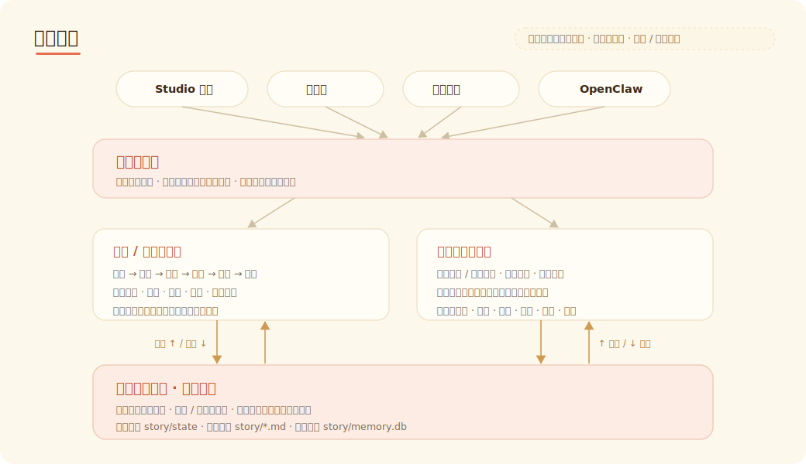
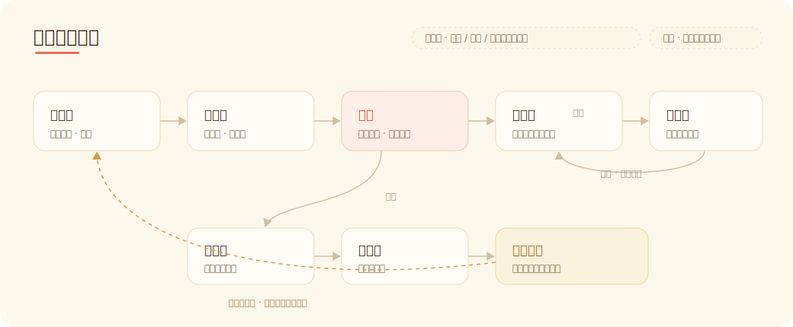
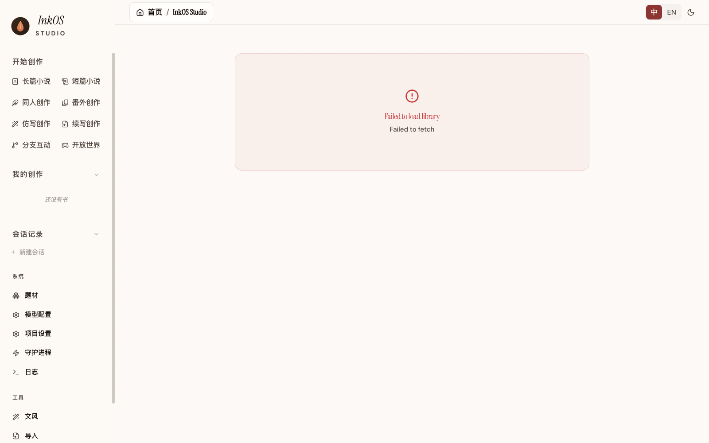

<p align="center">
  
  
</p>

<h1 align="center">Story Creation AI Agent<br><sub>面向长短篇小说、剧本剧作、互动影游与 IP 内容的创作智能体系统</sub></h1>

<p align="center">
  <a href="https://www.npmjs.com/package/@actalk/inkos"></a>
  <a href="LICENSE"></a>
  <a href="https://github.com/Narcooo/inkos/stargazers"></a>
  <a href="https://www.npmjs.com/package/@actalk/inkos"></a>
  <a href="https://clawhub.ai/narcooo/inkos"></a>
</p>

<p align="left">
  <picture>
    <source media="(prefers-color-scheme: dark)" srcset="https://kimi-file.moonshot.cn/prod-chat-kimi/kfs/4/1/2026-06-05/1d8h69mt3v89kkekg24gg">
    
  </picture>
  <br>
  🎉🎉 InkOS 入选首批 KIMI 开源合作伙伴 🎉🎉
</p>

<p align="center">
  <a href="README.en.md">English</a> | 中文 | <a href="README.ja.md">日本語</a>
</p>

<p align="center">
  <strong>InkOS 网页版上线！</strong>
  <a href="https://huohuaapi.com/apps">立刻体验</a>
</p>

---

InkOS 是一个面向故事创作的 AI Agent 系统：长篇连载、独立短篇、剧本剧作、同人番外、仿写续写和开放世界互动，都可以从同一个工作台开始。支持Studio、TUI、CLI交互形式，共享创意、设定、角色、记忆、审稿、修订、封面和互动状态只智能体，让故事能持续生产、持续修改、持续玩下去。

> 💡 **写小说，先给 Agent 接一层专业数据** —— 写小说不只缺模型，更缺素材。推荐搭配 [**火花数据API（huohuaapi）**](https://huohuaapi.com/)：按调用计费的小说 / 网文创作数据，让 Agent 动笔前先查小说正文、章节结构、人物设定、文风和创作方法等带来源素材，而不是只靠 Prompt 硬凑一份“剧情提纲”。

## v1.5.0 - InkOS Play 发布，开放世界，用想象力游玩

InkOS Play 发布和 Studio 体验升级：你可以用一句自然语言创建开放世界，让角色、物品、证据、关系和时间一起推进；也可以继续写长篇、做短篇、生成封面、改设定和查状态。系统会记住世界发生了什么，并在需要时把该看的上下文带给模型。

- **InkOS Play**：新增开放世界与分支互动。支持自由动作、可点击选择、世界契约、非固定时间推进、角色 agent、物品 / 证据 / 关系状态、HUD 和自动配图。
- **Studio UX**：开始创作、我的创作、会话记录、查看世界、配图与生成物预览都重新整理，Play 可以像文字游戏一样滚动游玩，而不是藏在命令行里。
- **记忆与上下文**：长篇和互动世界都开始进入“按任务取上下文”的模式。故事状态、Markdown 投影、SQLite 记忆、会话摘要和 protected / compressible 语义压缩共同工作，降低旧历史淹没当前指令的问题。
- **指令遵循**：Studio Chat、TUI 和 CLI 的自然语言入口统一到 action surface。普通讨论、确认建书、短篇、封面、Play、长篇写章和重写续写不再靠散落关键词抢跑，重动作先确认，完成态来自真实工具结果。
- **创作入口**：长篇、短篇、同人、番外、仿写、续写、封面制作和开放世界都成为 Studio 的一等入口。
- **模型与错误边界**：弱模型格式不稳时更少直接崩溃；模型服务错误、InkOS 执行错误和图片生成错误会更清楚地区分，方便判断是配置、供应商还是系统问题。

<p align="center">
  
</p>

**长篇小说** — 从创作简报建书，生成世界观、角色、卷纲、章节意图，按“写作 → 审稿 → 必要修订 → 状态结算”推进。上下文按 protected / compressible 分层组织，避免长书越写越乱。

**InkOS Short** — Studio Chat 和 CLI 可以直接产出独立短篇：完整正文、大纲记录、审稿记录、简介卖点、封面提示词，并在配置封面服务后生成封面图。

**InkOS Play** — 新增开放世界与分支互动。你可以用自然语言指定世界契约、时间推进方式、角色 agent、物品 / 证据 / 关系规则和视觉风格；系统维护世界状态、可点击选择、自由动作、HUD 和自动配图。

**Studio Chat** — 普通聊天、建书、短篇、封面、互动世界都走同一套 action surface。重动作先确认，生成物可预览，可通过聊天修改章节、封面提示词、世界状态和持久化文本产物。

**模型配置** — Studio 内置多服务配置、模型路由和封面服务配置；也支持 [kkaiapi](https://kkaiapi.com/) / OpenRouter 等全球主流模型聚合入口，以及自定义 OpenAI-compatible 服务。


**Native English novel writing now supported！** Set `--lang en` to write in English. See [English README](README.en.md) for details.

## 欢迎交流

> 当前更新相对频繁，后续会持续新增功能与优化写作效果。
> 欢迎加群反馈问题、提出需求，也欢迎关注项目动态 — 我们的目标是做最强的基于小说的内容生态创作 AI Agent。

<p align="center">
  
</p>

## 快速开始

### 安装

```bash
npm i -g @actalk/inkos
```

### 通过 OpenClaw 使用 🦞

InkOS 已发布为 [OpenClaw](https://clawhub.ai/narcooo/inkos) Skill，可被任何兼容 Agent（Claude Code、OpenClaw 等）直接调用：

```bash
clawhub install inkos          # 从 ClawHub 安装 InkOS Skill
```

通过 npm 安装或克隆本项目时，`skills/SKILL.md` 已包含在内，🦞 可直接读取——无需额外从 ClawHub 安装。

安装后，Claw 应优先通过共享交互入口调用 InkOS：

```bash
inkos interact --json --message "继续当前书，但把节奏再收紧一点"
```

这条入口直接走和项目 TUI 相同的交互执行内核，因此 OpenClaw、TUI、Studio 共用同一套控制脑。当前 JSON 输出包含 assistant 文本回复和 interaction session 信息；真正的执行结果以工具结果和落盘文件为准，不从模型口头声明推断完成。

`plan chapter` / `compose chapter` / `draft` / `audit` / `revise` / `write next` 这些原子命令仍然保留，但更适合作为底层工具，而不是 OpenClaw 的首选入口。也可以在 [ClawHub](https://clawhub.ai) 搜索 `inkos` 在线查看。

### InkOS 运行时 Skill

这里的 skill 指 InkOS Chat/Play/长篇写作内部可使用的专业能力包，和上面的 ClawHub Skill 不是同一个概念。它不会给模型额外执行权限，只提供专业规则、上下文需求和 prompt pack；创建、写入、编辑、生成图片仍然走 Studio 的工具权限和确认闸门。

可用方式：

- 在项目目录放置 `.inkos/skills/<skill-id>/SKILL.md`，Studio Chat 会在运行时自动加载。
- 或设置 `INKOS_SKILL_DIRS=/abs/path/to/skills`，可指向单个 skill 目录，也可指向包含多个 skill 子目录的目录。多个目录按系统分隔符分隔。
- 在 Chat 里用 `@skill-id` 强制本轮使用，例如：`@detective-play 做一个证据链驱动的开放世界`。
- 不写 `@skill-id` 时，系统会根据 session 类型和触发词自动选择内置 skill，例如长篇、开放世界、互动影游。

最小 `SKILL.md` 示例：

```md
---
id: detective-play
name: Detective Play
description: Detective evidence and suspect-board play.
whenToUse: Use for open-world detective play and evidence ledgers.
triggers: [侦探, evidence]
sessionKinds: [play]
contextNeeds:
  - id: evidence-ledger
    purpose: Preserve suspect, clue, and evidence chain state.
    sources: [world/evidence.md]
    tier: protected
    appliesTo: [play_step]
    retrieval: semantic
---
Use evidence chains; do not turn clues into generic atmosphere.
```

### 配置

当前 InkOS 将 LLM 配置分成两条清晰路径：**Studio 用可视化服务配置**，**CLI / daemon / 部署环境支持 env 覆盖**。两者不会互相污染。

#### 方式一：Studio 服务配置（推荐）

适合本地写作、Web 工作台和可视化管理。

```bash
inkos init my-novel
cd my-novel
inkos
```

打开 Studio 后进入「模型配置」：

1. 选择服务商，例如 Google Gemini、Moonshot、MiniMax、智谱、百炼或自定义端点。
2. 粘贴 API Key，点击「测试连接」。
3. 选择可用模型，保存配置。
4. 回到书籍页面开始写作。

Studio 运行时只使用：

```text
provider bank 默认值
→ inkos.json 里的 services / 当前 service / defaultModel
→ .inkos/secrets.json 里的 service API Key
```

即使检测到 `~/.inkos/.env` 或项目 `.env`，Studio 也只会展示提示，不会用 env 覆盖 service、model、baseUrl 或 API Key。API Key 存在项目内的 `.inkos/secrets.json`，不会写进 `inkos.json`。

#### 方式二：CLI / daemon / 部署环境的 env 配置

适合终端批处理、服务器部署、CI、Docker、守护进程和一次性切模型。

全局 env：

```bash
inkos config set-global \
  --provider <openai|anthropic|custom> \
  --base-url <API 地址> \
  --api-key <你的 API Key> \
  --model <模型名>
```

也可以手动写 `~/.inkos/.env` 或项目 `.env`：

```bash
INKOS_LLM_PROVIDER=custom
INKOS_LLM_BASE_URL=https://api.moonshot.cn/v1
INKOS_LLM_API_KEY=sk-...
INKOS_LLM_MODEL=kimi-k2.5

# 可选
INKOS_LLM_SERVICE=moonshot                         # 推荐写；不写时会尽量从 baseUrl 自动识别
INKOS_LLM_TEMPERATURE=0.7
INKOS_LLM_THINKING_BUDGET=0
INKOS_DEFAULT_LANGUAGE=zh
INKOS_LLM_EXTRA_top_p=0.9
```

CLI 合成顺序：

```text
Studio/project service 配置
→ .inkos/secrets.json service key
→ global ~/.inkos/.env
→ project .env
→ 当前进程环境变量
→ CLI 参数
```

也就是说，CLI 默认可以复用 Studio 配好的服务和密钥；如果 env 里声明了 `INKOS_LLM_SERVICE`、`INKOS_LLM_MODEL`、`INKOS_LLM_BASE_URL` 或 `INKOS_LLM_API_KEY`，则作为覆盖层生效。旧 env 只写 `baseUrl + model + apiKey` 也能继续用，InkOS 会尽量从 baseUrl 反推 service。

一次性指定服务或模型：

```bash
inkos write next --service google --model gemini-2.5-flash
inkos write next --service moonshot --model kimi-k2.5 --no-stream
inkos agent "继续写下一章" --api-key-env MOONSHOT_API_KEY
inkos doctor --service minimaxCodingPlan --model MiniMax-M2.7
```

`--service` 会从 provider bank 自动推导 baseUrl、协议和兼容策略；`--model` 必须属于最终 service，否则会直接报错，避免把 Kimi 模型发到 Gemini 这类错配问题。

#### 方式三：多模型路由（可选）

给不同 Agent 分配不同模型，按需平衡质量与成本：

```bash
# 给不同 agent 配不同模型/提供商
inkos config set-model writer <model> --provider <provider> --base-url <url> --api-key-env <ENV_VAR>
inkos config set-model auditor <model> --provider <provider>
inkos config show-models        # 查看当前路由
```

未单独配置的 Agent 自动使用全局模型。

#### 配置排查

```bash
inkos doctor
```

`doctor` 会显示当前 effective config mode、service/model/API Key 来源，并尝试 API 连通性。常见模式：


| 模式               | 含义                                        |
| ---------------- | ----------------------------------------- |
| `studio-project` | Studio 运行时：只使用 Studio/project 配置和 secrets |
| `cli-project`    | CLI 运行时：以 Studio 配置为基础，再叠加 env 和 CLI 参数   |
| `legacy-env`     | 旧 env 模式：兼容老项目的纯 `.env` 配置                |


如果服务测试失败，优先检查服务商、模型和协议是否匹配。Google Gemini 的 AI Studio API Key 可用于 Gemini OpenAI-compatible endpoint；InkOS 会自动禁用 Google 不支持的 OpenAI `store` 参数。MiniMax / MiniMax CodingPlan 默认走官方 OpenAI-compatible `/v1/chat/completions`，并优先使用可工作的非流式 transport，避免流式返回 usage 但无正文的问题。

### LLM 配置更新

- **Studio / CLI 配置隔离**：Studio 固定使用服务页配置和 `.inkos/secrets.json`；CLI、daemon、部署环境支持 env 覆盖和一次性命令参数。
- **Provider bank 能力表**：内置 Google Gemini、Moonshot、MiniMax、智谱、百炼、DeepSeek、硅基流动、火山、腾讯混元、文心、讯飞星火、OpenRouter、kkaiapi、Ollama、CodingPlan 等服务的 baseUrl、协议、模型和兼容策略。
- **模型归属校验**：`--service google --model kimi-k2.5` 这类错配会直接报错，避免把请求发到错误服务商。
- **Google Gemini 兼容修复**：AI Studio API Key 可直接用于 Gemini OpenAI-compatible endpoint，InkOS 会自动禁用 Google 不支持的 OpenAI `store` 参数。
- **MiniMax transport 探测**：MiniMax / MiniMax CodingPlan 使用官方 OpenAI-compatible `/v1` 入口，并自动使用可工作的非流式 transport，规避流式 usage 正常但正文为空的问题。
- **旧 env 兼容**：老的 `INKOS_LLM_BASE_URL + INKOS_LLM_MODEL + INKOS_LLM_API_KEY` 仍可用于 CLI；没有 `INKOS_LLM_SERVICE` 时会尝试从 baseUrl 反推服务商。

### 当前交互入口

**Studio Chat + CLI + TUI 共用同一套执行面**

- **Studio Chat**：讨论、建书、短篇、封面、Play、编辑持久化文件都从同一个对话入口发起；重动作会先展示确认卡。
- **开始创作入口**：长篇小说、短篇小说、同人创作、番外创作、仿写创作、续写创作、分支互动、开放世界都可以从 Studio 顶部入口进入。
- **TUI 仪表盘**：`inkos tui` 进入终端全屏交互，适合键盘流用户。
- **外部 Agent 入口**：`inkos interact --json --message "..."` 仍是 OpenClaw / 其他 agent 的结构化入口。
- **原子命令保留**：`plan` / `compose` / `draft` / `audit` / `revise` / `write next` 仍适合脚本和高级用户。

### 写第一本书

```bash
inkos book create --title "吞天魔帝" --genre xuanhuan  # 创建新书
inkos write next 吞天魔帝      # 写下一章（草稿 → 审计 → 按配置修订）
inkos status                   # 查看状态
inkos review list 吞天魔帝     # 审阅草稿
inkos review approve-all 吞天魔帝  # 批量通过
inkos export 吞天魔帝          # 导出全书
inkos export 吞天魔帝 --format epub  # 导出 EPUB（手机/Kindle 阅读）
```

### 写完整短篇

想直接生成一篇完整短篇，可以在 Studio 对话里说：

```text
写一篇 12 章短篇，方向是：都市婚姻反转，女主拿到账本证据后反杀。
```

也可以走 CLI：

```bash
inkos short run \
  --direction "都市短篇 婚姻反转 女主证据反杀" \
  --chapters 12 \
  --chars 1000
```

生成物会落在 `shorts/<故事名>/final/`，包含 `full.md`、`sales-package.md`、`cover-prompt.md`，配置封面服务后还会生成 `cover.png`。

### 单独制作封面

如果只想给已有标题或简介做封面，不需要重跑短篇正文，在 Studio 对话里直接说：

```text
给《她签下离婚协议那天，他悔疯了》生成一张短篇封面，偏现代都市、强反转。
```

封面工具会独立生成 `covers/<标题>/cover-prompt.md` 和 `covers/<标题>/cover.png`。如果还没有配置封面服务，先在 Studio 的模型配置里设置封面服务和 API Key。

生成后也可以继续通过 chat 改封面提示词，例如“把人物拉近一点、标题字更大、表情更冷笑”。系统会用新的 `coverPrompt` 重写 `cover-prompt.md` 并重生成封面，不需要重新写短篇。


### 启动开放世界 / 分支互动

在 Studio Chat 里选择「开放世界」或「分支互动」，直接用自然语言描述你想玩的世界：

```text
做一个魔兽风格的边境哨塔开放世界。时间不是固定回合，巡逻是一小时，练功可以跨几天。装备有稀有度，但不要数值面板，用材质和光泽体现。
```

系统会生成世界、角色、物品、证据、关系、当前场景和可选动作。开放世界支持自由输入动作；分支互动会给出可点击选项。配置封面 / 图片服务后，角色、物品、证据、场景都可以生成图，并在对话流里滚动显示。

---

## 核心特性

### Studio Chat + Action Surface

Studio Chat 不再只是问答框。它可以创建长篇、跑短篇、生成封面、启动 Play、编辑持久化文本文件，并在需要执行重动作前给出确认。普通讨论会直接回答；明确创作动作才进入工具执行。

### InkOS Play：开放世界与分支互动

Play 维护一个可持续推进的世界状态：角色、地点、物品、证据、关系、时间、场景和 HUD。它不是固定 RPG 模板，你可以用自然语言定义世界契约：修仙装备可以有稀有感，恋爱本可以有心动层级，侦探本可以有证据生命周期。系统把这些规则写进世界状态，再用于后续叙事和配图。

### 多维度审计 + 去 AI 味

连续性审计员从 37 个维度检查每一章草稿：角色记忆、物资连续性、伏笔回收、大纲偏离、叙事节奏、情感弧线等。内置 AI 痕迹检测维度，自动识别"LLM 味"表达（高频词、句式单调、过度总结）。默认长篇写作链路最多自动修订一次；如果你更看重自动闭环，可以通过 `writing.reviewRetries` 调整修订轮数。

去 AI 味规则内置于写手 agent 的 prompt 层——词汇疲劳词表、禁用句式、文风指纹注入，从源头减少 AI 生成痕迹。`revise --mode anti-detect` 可对已有章节做专门的反检测改写。

### 文风仿写

`inkos style analyze` 分析参考文本，提取统计指纹（句长分布、词频特征、节奏模式）和 LLM 风格指南。`inkos style import` 将指纹注入指定书籍，后续所有章节自动采用该风格，修订者也会用风格标准做审计。

### 创作简报

`inkos book create --brief my-ideas.md` 传入你的脑洞、世界观设定、人设文档。建筑师 agent 会基于简报生成故事设定（`story_bible.md`）和创作规则（`book_rules.md`），而非凭空创作；同时把简报落盘到 `story/author_intent.md`，让这本书的长期创作意图不会只在建书时生效一次。

### 输入治理控制面

每本书现在都有两份长期可编辑的 Markdown 控制文档：

- `story/author_intent.md`：这本书长期想成为什么
- `story/current_focus.md`：最近 1-3 章要把注意力拉回哪里

写作前可以先跑：

```bash
inkos plan chapter 吞天魔帝 --context "本章先把注意力拉回师徒矛盾"
inkos compose chapter 吞天魔帝
```

这会生成 `story/runtime/chapter-XXXX.intent.md`、`context.json`、`rule-stack.yaml`、`trace.json`。其中 `intent.md` 给人看，其他文件给系统执行和调试。`plan` 会调用 LLM 生成章节意图；`compose` 只编译本地文档和状态，可在没配好 API Key 前先验证控制输入。

### 字数治理

`draft`、`write next`、`revise` 现在共享同一套保守型字数治理：

- `--words` 指定的是目标字数，系统会自动推导一个允许区间，不承诺逐字精确命中
- 中文默认按 `zh_chars` 计数，英文默认按 `en_words` 计数
- 如果正文超出允许区间，InkOS 最多只会追加 1 次纠偏归一化（压缩或补足），不会直接硬截断正文
- 如果 1 次纠偏后仍然超出 hard range，章节照常保存，但会在结果和 chapter index 里留下长度 warning / telemetry

### 续写已有作品

`inkos import chapters` 从已有小说文本导入章节，自动重建结构化状态、章节摘要、伏笔、角色关系和可读 Markdown 投影，支持 `第X章` 和自定义分割模式、断点续导。导入后 `inkos write next` 可继续创作。

### 同人创作

`inkos fanfic init --from source.txt --mode canon` 从原作素材创建同人书。支持四种模式：canon（正典延续）、au（架空世界）、ooc（性格重塑）、cp（CP 向）。内置正典导入器、同人专属审计维度和信息边界管控——确保设定不矛盾。

### 多模型路由

不同 Agent 可以走不同模型和 Provider。写手用 Claude（创意强），审计用 GPT-4o（便宜快速），雷达用本地模型（零成本）。`inkos config set-model` 按 agent 粒度配置，未配置的自动回退全局模型。

### 守护进程 + 通知推送

`inkos up` 启动后台循环自动写章。管线会自动推进可处理的非关键问题；需要人工判断的问题会暂停并留下可审结果。通知推送支持 Telegram、飞书、企业微信、Webhook（HMAC-SHA256 签名 + 事件过滤）。日志写入 `inkos.log`（JSON Lines），`-q` 静默模式。

### 本地模型兼容

支持任何 OpenAI 兼容接口（Studio 里新增自定义服务，或 CLI 使用 `--provider custom` / `INKOS_LLM_PROVIDER=custom`）。服务测试会尝试不同协议和流式开关组合，并保存或提示可用 transport。Fallback 解析器处理小模型不规范输出，流中断时自动恢复部分内容。

### 可靠性保障

每章自动创建状态快照，`inkos write rewrite` 可回滚任意章节。写手动笔前输出自检表（上下文、资源、伏笔、风险），写完输出结算表，审计员交叉验证。文件锁防止并发写入。写后验证器含跨章重复检测和十余条硬规则自动 spot-fix。

伏笔系统使用 Zod schema 校验——`lastAdvancedChapter` 必须是整数，`status` 只能是 open/progressing/deferred/resolved。LLM 输出的 JSON delta 在写入前经过 `applyRuntimeStateDelta` 做 immutable 更新 + `validateRuntimeState` 结构校验。坏数据直接拒绝，不会滚雪球。

模型输出上限由 provider bank 的模型卡管理；`llm.extra` / `INKOS_LLM_EXTRA_*` 中的保留键（max_tokens、temperature、model、messages、stream 等）会被自动过滤，防止意外覆盖核心请求参数。

---

## 工作原理

InkOS 现在有两条主要运行线：长篇 / 短篇生产线负责生成可交付文本；Play 运行线负责持续互动世界。它们共享模型配置、Studio Chat、确认动作和产物预览，但状态结构不同。

<p align="center">
  
</p>

长篇每一章默认按“规划 → 编排 → 写作 → 审计 → 必要修订 → 状态同步”运行：

<p align="center">
  
</p>


| Agent               | 职责                                                                |
| ------------------- | ----------------------------------------------------------------- |
| **雷达 Radar**        | 扫描平台趋势和读者偏好，指导故事方向（可插拔，可跳过）                                       |
| **规划师 Planner**     | 读取作者意图 + 当前焦点 + 记忆检索结果，产出本章意图（must-keep / must-avoid）             |
| **编排师 Composer**    | 从结构化状态、控制文档和 Markdown 投影中按任务选择上下文，编译规则栈和运行时产物                     |
| **建筑师 Architect**   | 建书、导入或番外初始化时生成基础设定：故事框架、规则、角色与长期控制文件                              |
| **写手 Writer**       | 基于编排后的精简上下文生成正文（字数治理 + 对话引导）                                      |
| **观察者 Observer**    | 从正文中过度提取 9 类事实（角色、位置、资源、关系、情感、信息、伏笔、时间、物理状态）                      |
| **反射器 Reflector**   | 输出 JSON delta（而非全量 markdown），由代码层做 Zod schema 校验后 immutable 写入    |
| **归一化器 Normalizer** | 仅在正文明显偏离 hard range 时单 pass 压缩/扩展                                 |
| **连续性审计员 Auditor**  | 对照结构化状态、控制文档和章节上下文验证草稿，执行连续性与质量检查                                 |
| **修订者 Reviser**     | 修复审计发现的关键问题；默认最多自动修订一次，可通过 `writing.reviewRetries` 调整，其他问题标记给人工审核 |


如果审计不通过，默认管线只做一次"修订 → 再审计"；仍未解决的问题会保留在结果和状态里，交给人工或后续命令继续处理。需要更强自动闭环时，可以运行 `inkos config set writing.reviewRetries 3` 把修订轮数调高。

### 长期记忆

每本书的权威记忆由三层组成：


| 层                    | 用途                                                                                          |
| -------------------- | ------------------------------------------------------------------------------------------- |
| `story/state/*.json` | 权威结构化状态：当前状态、伏笔、章节摘要等，经过 Zod schema 校验                                                      |
| `story/*.md`         | 人类可读投影：`current_state.md`、`pending_hooks.md`、`chapter_summaries.md`、`character_matrix.md` 等 |
| `story/memory.db`    | Node 22+ 自动启用的 SQLite 时序记忆库，用于相关事实、伏笔和摘要检索                                                  |


连续性审计员对照这些状态检查每一章草稿。如果角色"记起"了从未亲眼见过的事，或者拿出了两章前已经丢失的武器，审计员会捕捉到。

Settler 不再要求模型输出完整 markdown 文件，而是输出 JSON delta，由代码层做 immutable apply + 结构校验后写入。Markdown 文件保留为人类可读投影。旧书首次运行时会从 legacy Markdown 自动迁移到结构化 JSON。

Node 22+ 环境下自动启用 SQLite 时序记忆数据库（`story/memory.db`），支持按相关性检索历史事实、伏笔和章节摘要，避免全量注入导致的上下文膨胀。

<p align="center">
  
</p>

### 控制面与运行时产物

除了运行时状态，InkOS 还把“护栏”和“自定义”拆成可审阅的控制层：

- `story/author_intent.md`：长期作者意图
- `story/current_focus.md`：当前阶段的关注点
- `story/runtime/chapter-XXXX.intent.md`：本章目标、保留项、避免项、冲突处理
- `story/runtime/chapter-XXXX.context.json`：本章实际选入的上下文
- `story/runtime/chapter-XXXX.rule-stack.yaml`：本章的优先级层和覆盖关系
- `story/runtime/chapter-XXXX.trace.json`：本章输入编译轨迹

这样 `brief`、卷纲、书级规则、当前任务不再混成一坨 prompt，而是先编译，再写作。

### 创作规则体系

写手 agent 内置 ~25 条通用创作规则（人物塑造、叙事技法、逻辑自洽、语言约束、去 AI 味），适用于所有题材。

在此基础上，每个题材有专属规则（禁忌、语言约束、节奏、审计维度），每本书有独立的 `book_rules.md`（主角人设、数值上限、自定义禁令）、`story_bible.md`（世界观设定）、`author_intent.md`（长期方向）和 `current_focus.md`（近期关注点）。`volume_outline.md` 仍然是默认规划，但在 v2 输入治理模式下不再天然压过当前任务意图。

## 使用模式

InkOS 提供四种交互方式，底层共享同一组原子操作：

### 1. 完整管线（一键式）

```bash
inkos write next 吞天魔帝          # 写草稿 → 审计 → 按配置自动修订
inkos write next 吞天魔帝 --count 5 # 连续写 5 章
```

`write next` 现在默认走 `plan -> compose -> write` 的输入治理链路，审计后的自动修订轮数默认是 1。若你需要回退到旧的 prompt 拼装路径，可在 `inkos.json` 中显式设置：

```json
{
  "inputGovernanceMode": "legacy"
}
```

默认值为 `v2`。`legacy` 仅作为显式 fallback 保留。

### 2. 原子命令（可组合，适合外部 Agent 调用）

```bash
inkos plan chapter 吞天魔帝 --context "本章重点写师徒矛盾" --json
inkos compose chapter 吞天魔帝 --json
inkos draft 吞天魔帝 --context "本章重点写师徒矛盾" --json
inkos audit 吞天魔帝 31 --json
inkos revise 吞天魔帝 31 --json
```

每个命令独立执行单一操作，`--json` 输出结构化数据。`plan` / `compose` 负责控制输入，`draft` / `audit` / `revise` 负责正文与质量链路。可被外部 AI Agent 通过 `exec` 调用，也可用于脚本编排。

### 3. 自然语言 Agent 模式

```bash
inkos agent "帮我写一本都市修仙，主角是个程序员"
inkos agent "写下一章，重点写师徒矛盾"
inkos agent "先扫描市场趋势，然后根据结果创建一本新书"
```

Agent 模式暴露的是按场景收窄后的工具集：建书、读写控制面、规划、编排、写作、审稿、修订、短篇、封面、Play 等能力会按当前 session 类型开放。推荐的 Agent 工作流是：先调整控制面，再 `plan` / `compose`，最后决定写草稿还是跑完整管线。

### 4. Studio Play 模式

Studio 里的「开放世界」和「分支互动」是交互式创作入口。它们不要求你先建书，也不要求写死 RPG 数值。你可以描述“世界怎样运行、时间怎样推进、角色是否自主行动、物品和证据怎样影响故事”，系统会生成可继续玩的世界，并把每回合状态写回本地。

## Studio 实测截图与生成结果

<p align="center">
  
</p>

<p align="center">
  <strong>InkOS Short 手机封面</strong><br>
  
</p>

<p align="center">
  <strong>InkOS Play 恋爱互动</strong><br>
  
</p>

<p align="center">
  <strong>InkOS Play 侦探互动</strong><br>
  
</p>

<p align="center">
  <strong>InkOS Play 物品配图</strong><br>
  
</p>

第一张是当前 Studio 的本地实测截图。后面四张来自 InkOS Short 和 InkOS Play 的真实本地生成结果：短篇封面用于手机端缩略图点击，Play 图用于展示开放世界、侦探证据、互动场景和物品视觉能力。

## 命令参考


| 命令                                          | 说明                                                                                         |
| ------------------------------------------- | ------------------------------------------------------------------------------------------ |
| `inkos init [name]`                         | 初始化项目（省略 name 在当前目录初始化）                                                                    |
| `inkos book create`                         | 创建新书（`--genre`、`--platform`、`--chapter-words`、`--target-chapters`、`--brief <file>` 传入创作简报） |
| `inkos book update [id]`                    | 修改书设置（`--chapter-words`、`--target-chapters`、`--status`）                                    |
| `inkos book list`                           | 列出所有书籍                                                                                     |
| `inkos book delete <id>`                    | 删除书籍及全部数据（`--force` 跳过确认）                                                                  |
| `inkos genre list/show/copy/create`         | 查看、复制、创建题材                                                                                 |
| `inkos plan chapter [id]`                   | 生成下一章的 `intent.md`（`--context` / `--context-file` 传入当前指令）                                  |
| `inkos compose chapter [id]`                | 生成下一章的 `context.json`、`rule-stack.yaml`、`trace.json`                                       |
| `inkos write next [id]`                     | 完整管线写下一章（`--words` 覆盖字数，`--count` 连写，`-q` 静默模式）                                            |
| `inkos write rewrite [id] <n>`              | 重写第 N 章（恢复状态快照，`--force` 跳过确认，`--words` 覆盖字数）                                              |
| `inkos draft [id]`                          | 只写草稿（`--words` 覆盖字数，`-q` 静默模式）                                                             |
| `inkos audit [id] [n]`                      | 审计指定章节                                                                                     |
| `inkos revise [id] [n]`                     | 修订指定章节                                                                                     |
| `inkos agent <instruction>`                 | 自然语言 Agent 模式                                                                              |
| `inkos review list [id]`                    | 审阅草稿                                                                                       |
| `inkos review approve-all [id]`             | 批量通过                                                                                       |
| `inkos status [id]`                         | 项目状态                                                                                       |
| `inkos export [id]`                         | 导出书籍（`--format txt/md/epub`、`--output <path>`、`--approved-only`）                           |
| `inkos radar scan`                          | 扫描平台趋势                                                                                     |
| `inkos fanfic init`                         | 从原作素材创建同人书（`--from`、`--mode canon/au/ooc/cp`）                                              |
| `inkos short run`                           | 生成独立短篇包（正文、简介卖点、封面提示词、可选封面图）                                                               |
| `inkos eval [id]`                           | 生成质量评估报告（支持 `--json`、章节范围）                                                                 |
| `inkos consolidate [id]`                    | 归并长篇章节摘要，降低长书上下文压力                                                                         |
| `inkos interact`                            | 外部 agent / CLI 自然语言入口（`--json`、`--message`、`--book`）                                       |
| `inkos config set-global`                   | 设置 CLI / daemon / 部署环境的全局 LLM env（`~/.inkos/.env`）                                         |
| `inkos config show-global`                  | 查看全局配置                                                                                     |
| `inkos config set/show`                     | 查看/更新项目配置                                                                                  |
| `inkos config set-model <agent> <model>`    | 为指定 agent 设置模型覆盖（`--base-url`、`--provider`、`--api-key-env` 支持多 Provider 路由）                |
| `inkos config remove-model <agent>`         | 移除 agent 模型覆盖（回退到默认）                                                                       |
| `inkos config show-models`                  | 查看当前模型路由                                                                                   |
| `inkos doctor`                              | 诊断配置问题（显示 effective config mode、来源、API 连通性和提供商兼容性提示）                                       |
| `inkos detect [id] [n]`                     | AIGC 检测（`--all` 全部章节，`--stats` 统计）                                                         |
| `inkos style analyze <file>`                | 分析参考文本提取文风指纹                                                                               |
| `inkos style import <file> [id]`            | 导入文风指纹到指定书                                                                                 |
| `inkos import canon [id] --from <parent>`   | 导入正传正典到番外书                                                                                 |
| `inkos import chapters [id] --from <path>`  | 导入已有章节续写（`--split`、`--resume-from`）                                                        |
| `inkos analytics [id]` / `inkos stats [id]` | 书籍数据分析（审计通过率、高频问题、章节排名、token 用量）                                                           |
| `inkos update`                              | 更新到最新版本                                                                                    |
| `inkos studio` / `inkos`                    | 启动 Web 工作台（`-p` 指定端口，默认 4567；Studio 使用服务页配置，不使用 env 覆盖）                                    |
| `inkos tui`                                 | 启动终端全屏 TUI                                                                                 |
| `inkos up / down`                           | 启动/停止守护进程（`-q` 静默模式，自动写入 `inkos.log`）                                                      |


`[id]` 参数在项目只有一本书时可省略，自动检测。所有命令支持 `--json` 输出结构化数据。`draft` / `write next` / `plan chapter` / `compose chapter` 支持 `--context` 传入创作指导，`--words` 覆盖每章目标字数。`book create` 支持 `--brief <file>` 传入创作简报（你的脑洞/设定文档），Architect 会基于此生成设定而非凭空创作。`plan chapter` 会调用 LLM 生成章节意图；`compose chapter` 不要求在线 LLM，可在配置 API Key 之前先检查输入治理结果。

CLI 运行时还支持一次性 LLM 覆盖参数：`--service`、`--model`、`--api-key-env`、`--base-url`、`--api-format <chat|responses>`、`--stream`、`--no-stream`。例如：

```bash
inkos write next --service google --model gemini-2.5-flash
inkos up --service moonshot --model kimi-k2.5 --api-key-env MOONSHOT_API_KEY
```

## 路线图

- ~~`packages/studio` Web UI 工作台（Vite + React + Hono）~~ — 已发布，`inkos` 或 `inkos studio` 启动
- ~~互动小说 / 开放世界（分支叙事 + 自由动作 + 自动配图）~~ — Studio Play 已落地
- 局部干预（重写半章 + 级联更新后续 truth 文件）
- 自定义 agent 插件系统
- 平台格式导出（起点、番茄等）

## 参与贡献

欢迎贡献代码。提 issue 或 PR。

```bash
pnpm install
pnpm dev          # 监听模式
pnpm test         # 运行测试
pnpm typecheck    # 类型检查
```

## Star History

<a href="https://www.star-history.com/#Narcooo/inkos&type=date&legend=top-left">
 <picture>
   <source media="(prefers-color-scheme: dark)" srcset="https://api.star-history.com/svg?repos=Narcooo/inkos&type=date&theme=dark&legend=top-left" />
   <source media="(prefers-color-scheme: light)" srcset="https://api.star-history.com/svg?repos=Narcooo/inkos&type=date&legend=top-left" />
   
 </picture>
</a>


## Skills Download History

<div align="center">

<a href="https://skill-history.com/narcooo/inkos">
  
</a>

</div>

## Repobeats


## Contributors

<a href="https://github.com/Narcooo/inkos/graphs/contributors">
  
</a>

## 致谢

InkOS 的 agent 运行时构建在 [pi](https://github.com/badlogic/pi-mono)（`@mariozechner/pi-ai` 与 `@mariozechner/pi-agent-core`，作者 Mario Zechner）之上。感谢 pi 提供的扎实底座。

本开源项目已链接并认可 [LINUX DO](https://linux.do/) 社区，感谢社区成员的反馈、测试与讨论。

## 许可证

[AGPL-3.0](LICENSE)
