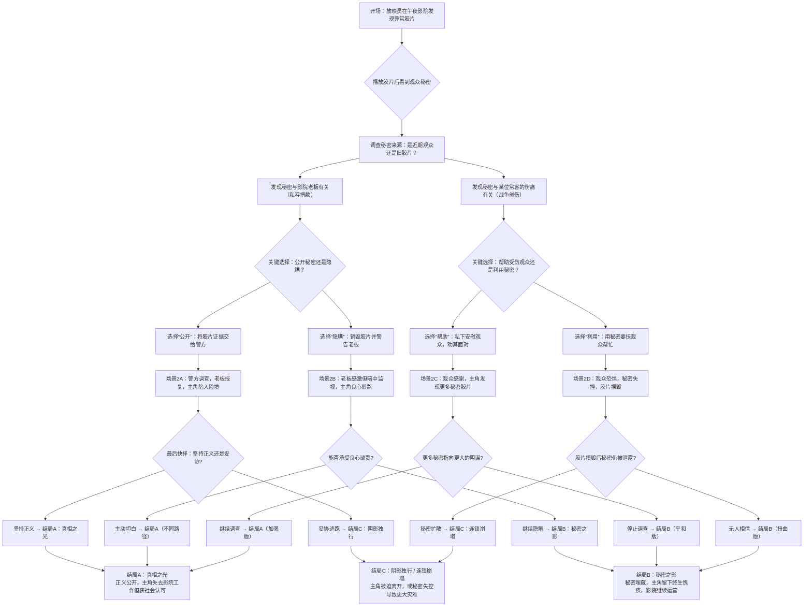

```mermaid
flowchart TD
    A[开场：放映员在午夜影院发现异常胶片] --> B{播放胶片后看到观众秘密}
    B --> C[调查秘密来源：是近期观众还是旧胶片？]
    C --> D[发现秘密与影院老板有关（私吞捐款）]
    C --> E[发现秘密与某位常客的伤痛有关（战争创伤）]
    D --> F{关键选择：公开秘密还是隐瞒？}
    F --> G[选择“公开”：将胶片证据交给警方]
    F --> H[选择“隐瞒”：销毁胶片并警告老板]
    E --> I{关键选择：帮助受伤观众还是利用秘密？}
    I --> J[选择“帮助”：私下安慰观众，劝其面对]
    I --> K[选择“利用”：用秘密要挟观众帮忙]
    G --> L[场景2A：警方调查，老板报复，主角陷入险境]
    H --> M[场景2B：老板感激但暗中监视，主角良心煎熬]
    J --> N[场景2C：观众感谢，主角发现更多秘密胶片]
    K --> O[场景2D：观众恐惧，秘密失控，胶片损毁]
    L --> P{最后抉择：坚持正义还是妥协?}
    P --> Q[坚持正义 → 结局A：真相之光]
    P --> R[妥协逃跑 → 结局C：阴影独行]
    M --> S{能否承受良心谴责?}
    S --> T[主动坦白 → 结局A（不同路径）]
    S --> U[继续隐瞒 → 结局B：秘密之影]
    N --> V{更多秘密指向更大的阴谋?}
    V --> W[继续调查 → 结局A（加强版）]
    V --> X[停止调查 → 结局B（平和版）]
    O --> Y{胶片损毁后秘密仍被泄露?}
    Y --> Z[秘密扩散 → 结局C：连锁崩塌]
    Y --> AA[无人相信 → 结局B（扭曲版）]
    Q & T & W --> END_A[结局A：真相之光<br>正义公开，主角失去影院工作但获社会认可]
    U & X & AA --> END_B[结局B：秘密之影<br>秘密埋藏，主角留下终生愧疚，影院继续运营]
    R & Z --> END_C[结局C：阴影独行 / 连锁崩塌<br>主角被迫离开，或秘密失控导致更大灾难]
```

**说明**：主线由两段首关键选择（公开/隐瞒、帮助/利用）产生**2个主要分支**，最终通往**3个结局**（至少2个，实际3个）。每段剧情自然分为三节：发现秘密、处理秘密、结局收束。

---
